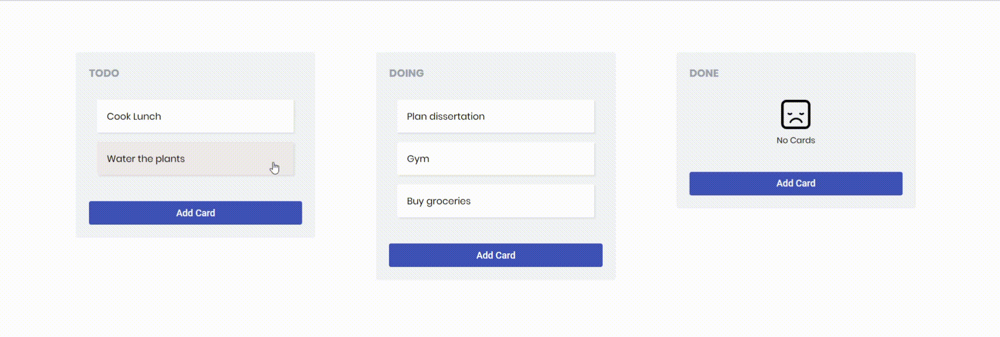

# Angular ToDo Application

###  Specifications:
* Build a todo list single page application.
* Add/Edit/Delete todo items
* Mark todo item as done
* Ability to filter items in the todo list

### Quick start

#### change into the repo directory
`cd main`

#### install
`npm install`

#### serve
`npm run server`                   
`npm run start`

#### Running unit tests
`npm run test`
